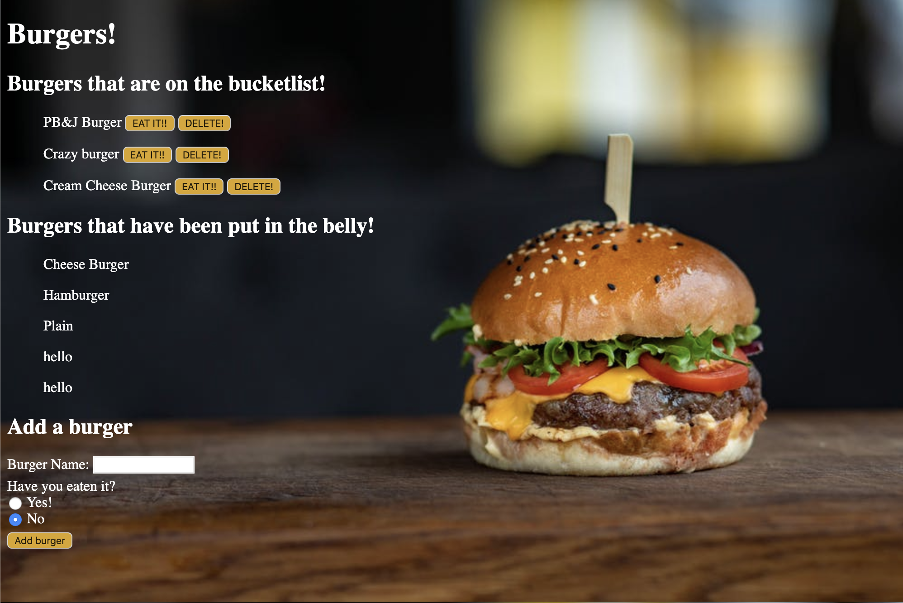

# Burger Bucketlist

In this project I created a Burger Bucketlist that allows you to put new burgers that you want to try and be able to delete the burger or move it to the eaten section of the page.

### User Story:

```
As a burger enthusiast
I want to generate a webpage that displays burgers that IO would like to try so that I can try new burgers and get creative.
```

<br>

The following image displays the example:



<br>


Here's the link: [DIG IN!!](https://frozen-shore-70892.herokuapp.com/)

